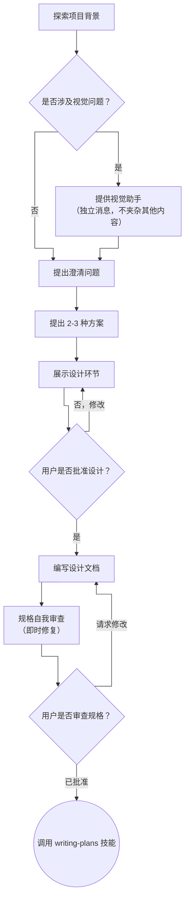

# 头脑风暴：从想法到设计

通过自然的协作对话，帮助将想法转化为完整的设计和规格说明。

首先了解当前的项目背景，然后逐一提问来细化想法。一旦理解了要构建的内容，就展示设计并获取用户批准。

<HARD-GATE>
在展示设计并获得用户批准之前，不要调用任何实现技能、编写任何代码、搭建任何项目或采取任何实现行动。这适用于所有项目，无论其看起来多么简单。
</HARD-GATE>

## 反模式："这太简单了，不需要设计"

每个项目都必须经过这个过程。待办事项列表、单功能工具、配置更改——无一例外。所谓"简单"的项目正是未经审视的假设造成最多浪费的地方。设计可以很短（对于真正简单的项目只需几句话），但你必须展示它并获得批准。

## 检查清单

你必须为以下每一项创建任务并按顺序完成：

1. **探索项目背景** — 检查文件、文档、最近的提交
2. **提供视觉助手**（如果话题涉及视觉问题）—— 这是独立的消息，不要与澄清问题合并。详见下方的视觉助手部分。
3. **提出澄清问题** — 一次一个，理解目的/约束/成功标准
4. **提出 2-3 种方案** — 包含权衡取舍和你的建议
5. **展示设计** — 按复杂度分节展示，每节之后获取用户批准
6. **编写设计文档** — 保存到 `docs/superpowers/specs/YYYY-MM-DD-<topic>-design.md` 并提交
7. **规格自我审查** — 快速检查占位符、矛盾、歧义、范围（见下方）
8. **用户审查书面规格** — 请用户在继续前审查规格文件
9. **过渡到实现** — 调用 `writing-plans` 技能创建实现计划

## 流程图

**终止状态是调用 `writing-plans`。** 不要调用 `frontend-design`、`mcp-builder` 或任何其他实现技能。在头脑风暴之后，你唯一应该调用的技能是 `writing-plans`。

## 过程

**理解想法：**

- 首先查看当前项目状态（文件、文档、最近的提交）
- 在问详细问题之前，先评估范围：如果请求描述了多个独立的子系统（例如，"构建一个包含聊天、文件存储、计费和分析的平台"），立即标记出来。不要花时间在一个需要分解的项目上细化细节。
- 如果项目太大，不适合一个规格说明，帮助用户将其分解为子项目：哪些是独立的组件，它们如何关联，应该按什么顺序构建？然后通过正常的设计流程来头脑风暴第一个子项目。每个子项目都有自己的规格说明 → 计划 → 实现周期。
- 对于规模合适的项目，逐一提问来细化想法
- 尽可能使用选择题，但开放式问题也可以
- 每条消息只问一个问题——如果一个话题需要更多探索，分成多个问题
- 专注于理解：目的、约束、成功标准

**探索方案：**

- 提出 2-3 种不同的方案，包含权衡取舍
- 以对话方式展示选项，给出你的建议和理由
- 先给出推荐的选项并解释原因

**展示设计：**

- 一旦你认为理解了要构建的内容，就展示设计
- 按复杂度调整每个部分的长度：如果简单就几句话，如果复杂就 200-300 字
- 每节之后询问是否看起来正确
- 涵盖：架构、组件、数据流、错误处理、测试
- 如果某些内容不清楚，准备好回去澄清

**为隔离性和清晰性而设计：**

- 将系统分解为更小的单元，每个单元有一个明确的职责，通过定义良好的接口通信，并且可以独立理解和测试
- 对于每个单元，你应该能够回答：它做什么，如何使用它，它依赖什么？
- 有人能在不阅读内部实现的情况下理解一个单元的作用吗？你能在不破坏消费者的情况下更改内部实现吗？如果不能，边界需要改进。
- 更小、边界清晰的单元也更容易处理——你能一次性在脑中容纳的代码，你能更好地推理，当你编辑的文件职责聚焦时，你的编辑更可靠。当一个文件变得太大时，这通常是它做了太多事情的信号。

**在现有代码库中工作：**

- 在提出更改之前，先探索现有结构。遵循现有模式。
- 如果现有代码存在影响工作的问题（例如，文件太大、边界不清晰、职责纠缠），将针对性的改进作为设计的一部分——就像一个好的开发者在工作中改进代码一样。
- 不要提议无关的重构。专注于服务于当前目标的内容。

## 设计之后

**文档：**

- 将经过验证的设计（规格）写入 `docs/superpowers/specs/YYYY-MM-DD-<topic>-design.md`
  -（用户对规格位置的偏好优先于此默认位置）
- 如果可用，使用 `elements-of-style:writing-clearly-and-concisely` 技能
- 将设计文档提交到 git

**规格自我审查：**
编写规格文档后，用 fresh eyes 审视：

1. **占位符扫描：** 是否有 "TBD"、"TODO"、不完整的章节或模糊的需求？修复它们。
2. **内部一致性：** 是否有章节相互矛盾？架构是否与功能描述匹配？
3. **范围检查：** 这是否足够聚焦，适合一个实现计划，还是需要分解？
4. **歧义检查：** 是否有需求可以以两种不同方式解释？如果是，选择一种并明确说明。

修复所有问题。不需要重新审查——只需修复并继续。

**用户审查关卡：**
规格审查循环通过后，请用户在继续前审查书面规格：

> "规格已编写并提交到 `<path>`。请在继续编写实现计划之前审查它，如果需要任何更改，请告诉我。"

等待用户的回复。如果他们请求更改，进行修改并重新运行规格审查循环。只有在用户批准后，才继续。

**实现：**

- 调用 `writing-plans` 技能来创建详细的实现计划
- 不要调用任何其他技能。`writing-plans` 是下一步。

## 关键原则

- **一次只问一个问题** — 不要问太多问题压倒用户
- **优先选择题** — 比开放式问题更容易回答
- **无情地 YAGNI** — 从所有设计中移除不必要的功能
- **探索替代方案** — 在确定之前，总是提出 2-3 种方案
- **增量验证** — 展示设计，在继续前获得批准
- **保持灵活** — 当某些内容不清楚时，回去澄清

## 视觉助手

一个基于浏览器的助手，用于在头脑风暴期间展示模型、图表和视觉选项。作为工具提供，而不是模式。接受视觉助手意味着它可用于受益于视觉处理的问题；并不意味着每个问题都通过浏览器。

**提供视觉助手：** 当你预期即将到来的问题将涉及视觉内容（模型、布局、图表）时，征求一次同意：

> "我们处理的部分内容，如果能在网页浏览器中展示给你，可能会更容易理解。我可以随时整理模型、图表、对比图和其他视觉内容。这个功能仍然较新，且可能消耗大量 token。想试试吗？（需要打开本地 URL）"

**这个提议必须是独立的消息。** 不要与澄清问题、背景总结或任何其他内容合并。消息应该只包含上面的提议，其他什么都不说。等待用户的回复再继续。如果他们拒绝，就只用文本继续头脑风暴。

**每问题的决定：** 即使在接受之后，对每个问题都要决定是否使用浏览器或终端。测试标准是：**用户是通过看比读更好理解这个问题吗？**

- **使用浏览器** 对于视觉内容——模型、线框图、布局对比、架构图、并排视觉设计
- **使用终端** 对于文本内容——需求问题、概念选择、权衡列表、A/B/C/D 文本选项、范围决策

一个关于 UI 主题的问题不一定是视觉问题。"在这个上下文中 personality 是什么意思？" 是概念问题——使用终端。"哪个向导布局更好？" 是视觉问题——使用浏览器。

如果他们同意使用视觉助手，在继续前阅读详细指南：
`skills/brainstorming/visual-companion.md`
